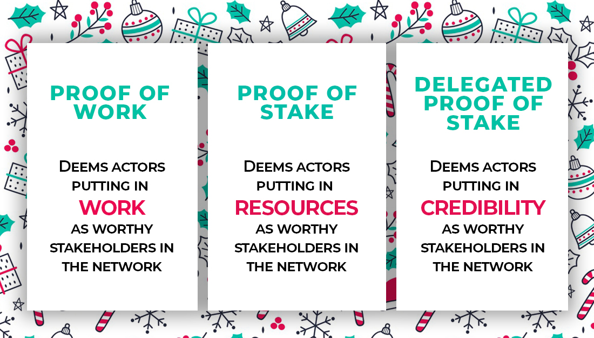
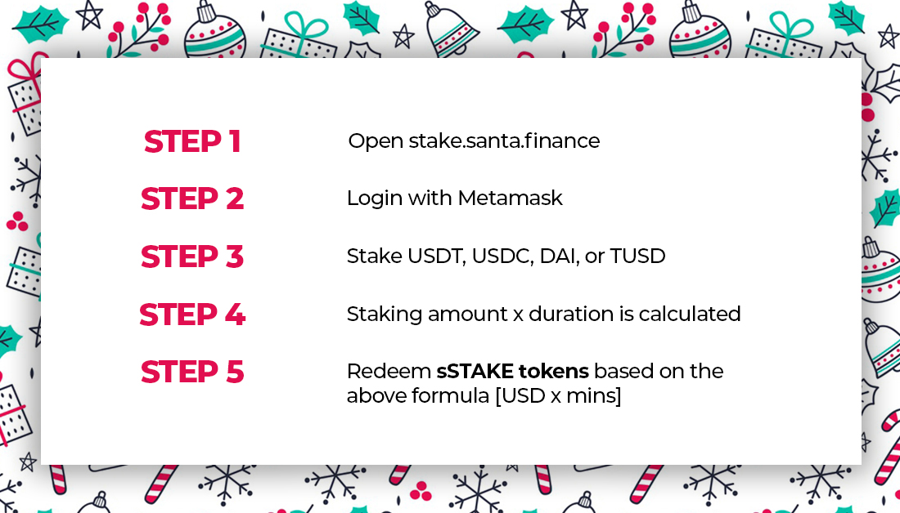

## Not only for your average crypto-whale 🐋  🎅 Santa.finance is the much needed DeFi fairytale 🧚

### Yield Farming or liquidity mining revolutionized the token distribution process with no pre-mine, no venture capital, and no founder fees. The goal for yield farming is to have a better distribution of tokens for governance but it has turned out to be quite the opposite. 
   

   
   

# Introducing Yield Farming 2.0

### Santa.finance introduces a new yield farming mechanism that ensures a very diverse participation in the governance community. $SNTA is mined by three key stakeholders of the santa.finance community. 

   
   
### Projects using only liquidity mining end up with crypto whales acting as lenders, borrowers and governance stakeholders. Santa.finance incentivises user behaviour to encourage participation of everyone. 

### Without reinventing the wheel, santa.finance takes important learnings from user behaviour in three widely adopted consensus mechanisms. 

### Based on the above learnings, stakeholders are incentivised for their work, resources and credibility in santa.finance. 10,000 $SNTA are allocated for users (borrowers), 10,000 $SNTA for liquidity providers (lenders), and 10,000 $SNTA for adoption drivers (Influencers)

### Platform users (Borrowers) don’t have resources (capital) at disposal, but they do possess the ultimate resource - TIME. Users can invest their time to redeem sTIME tokens. Santa.finance gives true meaning to the concept of ‘TIME IS MONEY’

### Liquidity providers can provide liquidity to the sPOOL by staking USDT, USDC, DAI, or TUSD and redeem sSTAKE tokens with liquidity mining. 

### Adoption is extremely important for a DAO to function, adoption drivers contribute by spreading awareness on Twitter and redeem sCRED tokens for their effort. 

### After the genesis mining period ends, $SNTA tokens can be redeemed against sTIME, sSTAKE, and sCRED tokens based on the following formula

### Yield farming 2.0 is here!
### D E C E N T R A L I Z E

[Twitter](https://twitter.com/defisanta)
